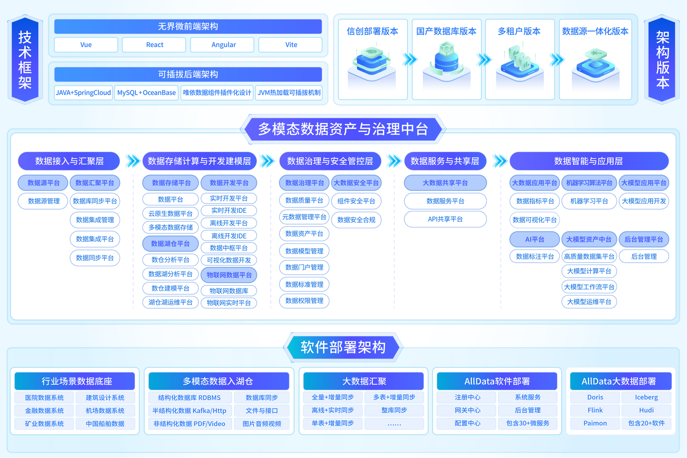

欢迎来到AllData可定义数据中台
=========================

👋 欢迎来到AllData数据中台产品工作空间，如果需要加入开源社群+商业版产品演示+商业版报价采购，请联系我们市场同事以及公司负责人。
AllData可定义数据中台以底层数据平台为基础底座，数据中台作为业务数据互通枢纽，机器学习平台承担模型生产工厂职能，大模型应用面向业务端输出上层智能化产品，完整覆盖数据治理、模型训练、智能应用全流程链路。
* 17+大模块39+核心功能，支持信创版本+国产数据库版本
* 国产化数据库+信创一体化版本，满足企业响应国家信创战略要求。
* 底层底座：标准化数据平台，统一数据存储、接入与治理能力
* 中间枢纽：一体化数据中台，打通全域数据资产，实现数据共享复用
* 模型工厂：专业机器学习平台，支撑算法训练、特征加工与模型迭代
* 上层应用：行业大模型应用，面向业务场景交付智能化落地产品

✨ 杭州奥零数据科技官网：http://www.aolingdata.com

✨ Github项目：https://github.com/alldatacenter/alldata

✨ AllData官方手册：https://www.yuque.com/aolingdata/product

✨ AllData正式环境：http://43.138.162.243:5173/ui_moat

Documentation
------------------
.. toctree::
  :maxdepth: 1
  :caption: 快速开始
  installDeploy/index
.. toctree::
  :maxdepth: 3
  :caption: 产品演示
  document/index
.. toctree::
  :maxdepth: 3
  :caption: 功能手册
  userGuide/index
.. toctree::
  :maxdepth: 3
  :caption: 社区共建
  meetup/index
.. toctree::
  :maxdepth: 3
  :caption: 新版本发布
  plan/index
